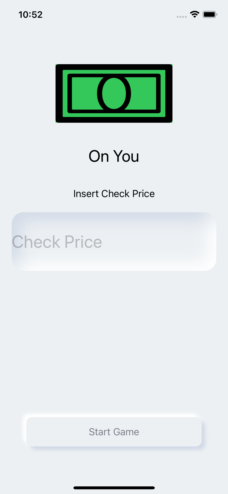
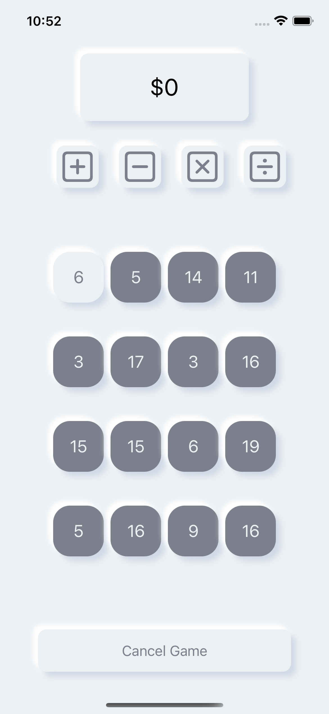
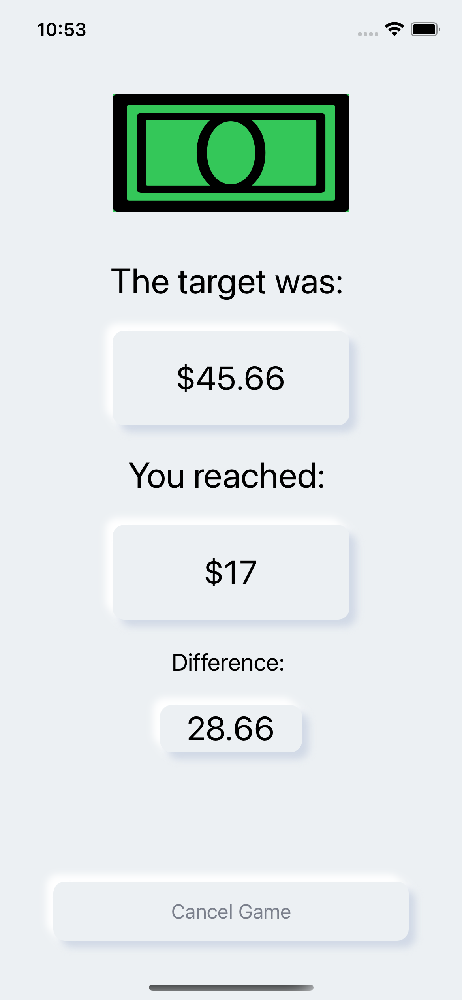

# 

#### OnYou is a fun simple game to find out if you're treating who!

---

## Table of contents

- [General info](#general-info)
- [Screenshots](#screenshots)
- [Technologies](#technologies)
- [Setup](#setup)
- [Features](#features)
- [Contact](#contact)

## General info

OnYou is a simple grid based number game that allows you to see who is treating who for the given meal. Start in the top left and add, subtract, multiply, and divide your way down to the bottom right. How close are you to the check's total? Closer than your friends? You win!

## Screenshots

## Technologies

## Setup

1. Fork and close this repo
2. Start up xcode
3. Run your emulator!

## Features

- Grid based number game
- Neumorphic design scheme
- Enter the total of your check

## Contact

  

    <h3>Nick - Tech Lead</h3>
    
     
    
    

